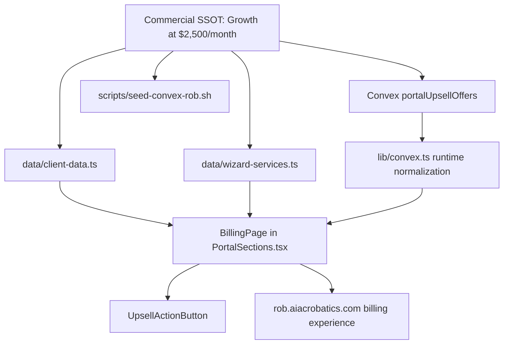

# Rob Campbell Retainer UI Correction

## Confirmed Commercial State

- Active agreement: Growth Retainer
- Monthly amount: $2,500
- Included capacity: 7 development or consulting hours per month
- AI usage: expanded usage included
- Retainer selection: complete; the portal must not ask Rob to choose again
- Invoice standing: tracked separately from the agreed plan

## Architecture Map

```text
Julian's confirmed agreement
            |
            v
Commercial source of truth ($2,500 Growth)
            |
       +----+------------------+
       |                       |
       v                       v
Static portal data       Convex portalUpsellOffers
       |                       |
       +-----------+-----------+
                   v
             Portal runtime
                   |
                   v
              Billing page
       +-----------+------------+
       |            |            |
       v            v            v
Growth: active  Operator: hidden  Build Partner: optional
No request CTA  Never rendered     Upgrade request allowed
```

## Dependency Graph



## Component Changes

| Component | Change | Client-visible result |
| --- | --- | --- |
| `data/client-data.ts` | Replace tier-selection language with the confirmed Growth agreement and included capacity. | Billing copy states the correct active plan. |
| `data/wizard-services.ts` | Mark Growth active and Operator hidden for Rob. | Static fallback matches Convex. |
| `components/PortalSections.tsx` | Filter hidden offers, style `active` correctly, suppress purchase/request CTA for the active plan, and remove the tier-choice fallback message. | Rob sees one current plan and only genuine optional upgrades. |
| `components/ClientPortalActions.tsx` | Preserve request behavior for optional offers only. | The current agreement cannot be accidentally requested or purchased again. |
| `scripts/seed-convex-rob.sh` | Replace stale selection tasks and offer statuses. | Future reseeding cannot restore incorrect $1,500 prompts. |

## Verification

1. Typecheck and build the portal.
2. Confirm Convex reads Growth as `active`, Operator as `hidden`, and Build Partner as `available`.
3. Test Billing on desktop and mobile.
4. Verify the active Growth plan has no request/payment CTA.
5. Verify hidden Operator content is absent from rendered HTML.
6. Verify static fallback and live Convex mode show the same commercial state.

## Impact

This changes presentation and stale seed data only. It does not create a charge, change a payment record, alter the Convex schema, or modify Rob's signed commercial terms.
